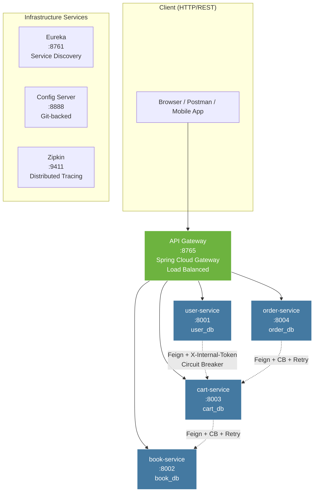

<div align="center">

<h1>📚 BookStore Microservices</h1>

<p>
  <strong>A production-ready e-commerce REST API built on a microservices architecture.</strong><br/>
  Domain isolation · JWT + internal token security · Circuit breakers · Distributed tracing
</p>

<p>
  
  
  
  
  
  
</p>

<p>
  <a href="#-overview">Overview</a> ·
  <a href="#-architecture">Architecture</a> ·
  <a href="#-services">Services</a> ·
  <a href="#-security-model">Security</a> ·
  <a href="#-api-reference">API</a> ·
  <a href="#-getting-started">Getting Started</a> ·
  <a href="#-tech-stack">Tech Stack</a>
</p>

</div>

---

## 🧭 Overview

BookStore is a fully decomposed microservices backend for an online bookstore — covering user authentication, book catalog management, shopping cart, and order processing. Each domain is an independently deployable Spring Boot service with its own MySQL database, communicating over HTTP via OpenFeign with full fault tolerance.

**Key design decisions:**

- **No shared databases** — each service owns its data exclusively, enforcing true domain isolation
- **Two-tier auth** — JWT for external clients, a shared-secret internal token for service-to-service calls, managed through a `common-security` shared library
- **Resilience by default** — every Feign client is wrapped in a Circuit Breaker + Retry chain via Resilience4j
- **Schema-as-code** — Liquibase manages all migrations; Hibernate is set to `validate` only
- **Full observability** — Micrometer tracing exported to Zipkin, health and circuit breaker metrics via Actuator

---

## ✨ Key Features

- **Complete domain isolation** — no shared databases
- **Two-tier security** — JWT for clients + internal shared-secret token
- **Resilience by design** — every Feign client wrapped in Circuit Breaker + Retry (Resilience4j)
- **Zero-downtime ready** — independent services, Eureka, Config Server
- **Full observability** — distributed tracing (Zipkin) + Actuator + Micrometer
- **Schema-as-code** — Liquibase migrations, Hibernate `validate` only
- **Production-ready** — Docker Compose support included

---

## 🏗 Architecture



### Service Interaction Map

```
user-service   ──[register: create cart]──────────────►  cart-service
                       POST /cart/internal/{userId}

cart-service   ──[add item: fetch book details]───────►  book-service
                       GET /books/internal/{bookId}

order-service  ──[create order: fetch cart]───────────►  cart-service
                       GET /cart/internal/{userId}

order-service  ──[after order: clear cart]────────────►  cart-service
                       DELETE /cart/internal/{userId}/clear
```

All internal calls use `X-Internal-Token` header, are never reachable from the gateway, and are protected by circuit breakers with automatic fallbacks.

---

## 🧩 Services

| Service | Port | Database | Responsibility |
|---------|------|----------|----------------|
| **api-gateway** | `8765` | — | Single entry point, routing, load balancing |
| **user-service** | `8001` | `user_db` | Registration, login, JWT issuance |
| **book-service** | `8002` | `book_db` | Book catalog, categories, search |
| **cart-service** | `8003` | `cart_db` | Shopping cart and cart items |
| **order-service** | `8004` | `order_db` | Order lifecycle and order items |
| **config-server** | `8888` | — | Centralized Git-backed configuration |
| **naming-server** | `8761` | — | Eureka service registry |
| **common-security** | *lib* | — | Shared JWT + internal token library |

---

## 🔐 Security Model

### Two-tier authentication

```
╔═══════════════════════════════════════════════════════════════╗
║  TIER 1 — External  (client → gateway → service)             ║
║                                                               ║
║  Authorization: Bearer <JWT>                                  ║
║                                                               ║
║  • Issued by user-service on successful login                 ║
║  • Signed with HMAC-SHA256 using shared JWT_SECRET            ║
║  • Contains: userId (Long), roles (List<String>)              ║
║  • Verified independently by each service — no DB lookup      ║
╚═══════════════════════════════════════════════════════════════╝

╔═══════════════════════════════════════════════════════════════╗
║  TIER 2 — Internal  (service → service only)                 ║
║                                                               ║
║  X-Internal-Token: <INTERNAL_TOKEN>                           ║
║                                                               ║
║  • Fixed shared secret from environment, never exposed        ║
║  • Only valid on /*/internal/** URL patterns                  ║
║  • Checked by InternalRequestFilter on every service          ║
║  • Auto-injected into all Feign calls via                     ║
║    InternalTokenRequestInterceptor (Spring auto-config)       ║
╚═══════════════════════════════════════════════════════════════╝
```

### JWT Token Structure

```json
{
  "sub": "user@example.com",
  "userId": 42,
  "roles": ["ROLE_USER"],
  "iat": 1710000000,
  "exp": 1710003600
}
```

The `userId` claim is extracted by `JwtAuthenticationFilter` and stored as the Spring Security principal — controllers retrieve ownership directly from `SecurityContextHolder` with zero additional queries.

### Role Matrix

| Endpoint Group | ROLE_USER | ROLE_ADMIN |
|----------------|:---------:|:----------:|
| Read books / categories | ✅ | ✅ |
| Create / update / delete books | ❌ | ✅ |
| Manage own cart | ✅ | ✅ |
| Place and read own orders | ✅ | ✅ |
| Update any order status | ❌ | ✅ |

---

## 🌐 API Reference

**Base URL:** `http://localhost:8765`  
All endpoints except `/api/auth/**` require `Authorization: Bearer <token>`.

---

### 🔑 Authentication  `POST /api/auth`

| Method | Endpoint | Auth | Description |
|--------|----------|------|-------------|
| `POST` | `/api/auth/registration` | Public | Register — auto-creates shopping cart |
| `POST` | `/api/auth/login` | Public | Login — returns signed JWT |

<details>
<summary><b>POST /api/auth/registration</b></summary>

```json
// Request body
{
  "email": "john@example.com",
  "password": "SecurePass1",
  "repeatPassword": "SecurePass1",
  "firstName": "John",
  "lastName": "Doe",
  "shippingAddress": "123 Main St, New York"
}

// 201 Created
{
  "id": 1,
  "email": "john@example.com",
  "firstName": "John",
  "lastName": "Doe",
  "shippingAddress": "123 Main St, New York"
}
```
</details>

<details>
<summary><b>POST /api/auth/login</b></summary>

```json
// Request body
{
  "email": "john@example.com",
  "password": "SecurePass1"
}

// 200 OK
{
  "token": "eyJhbGciOiJIUzI1NiJ9.eyJ1c2VySWQiOjEsInN1YiI6ImpvaG4..."
}
```
</details>

---

### 📖 Books  `GET /api/books`

| Method | Endpoint | Auth | Description |
|--------|----------|------|-------------|
| `GET` | `/api/books` | USER / ADMIN | List all books (paginated) |
| `GET` | `/api/books/{id}` | USER / ADMIN | Get book by ID |
| `GET` | `/api/books/search` | USER / ADMIN | Search by title or author |
| `POST` | `/api/books` | ADMIN | Create book |
| `PUT` | `/api/books/{id}` | ADMIN | Update book |
| `DELETE` | `/api/books/{id}` | ADMIN | Soft-delete book |

---

### 🗂 Categories  `/api/categories`

| Method | Endpoint | Auth | Description |
|--------|----------|------|-------------|
| `GET` | `/api/categories` | USER / ADMIN | List all categories |
| `GET` | `/api/categories/{id}` | USER / ADMIN | Get category by ID |
| `GET` | `/api/categories/{id}/books` | USER / ADMIN | All books in a category |
| `POST` | `/api/categories` | ADMIN | Create category |
| `PUT` | `/api/categories/{id}` | ADMIN | Update category |
| `DELETE` | `/api/categories/{id}` | ADMIN | Soft-delete category |

---

### 🛒 Shopping Cart  `/api/cart`

| Method | Endpoint | Auth | Description |
|--------|----------|------|-------------|
| `GET` | `/api/cart` | USER / ADMIN | Get current user's cart |
| `POST` | `/api/cart` | USER / ADMIN | Add book to cart |
| `PUT` | `/api/cart/items/{id}` | USER / ADMIN | Update item quantity |
| `DELETE` | `/api/cart/items/{id}` | USER / ADMIN | Remove item from cart |

---

### 📦 Orders  `/api/orders`

| Method | Endpoint | Auth | Description |
|--------|----------|------|-------------|
| `POST` | `/api/orders` | USER / ADMIN | Create order from current cart |
| `GET` | `/api/orders` | USER / ADMIN | List current user's orders |
| `GET` | `/api/orders/{id}/items` | USER / ADMIN | Get items in an order |
| `GET` | `/api/orders/{id}/items/{itemId}` | USER / ADMIN | Get a specific order item |
| `PATCH` | `/api/orders/{id}` | ADMIN | Update order status |

---

## 🚀 Getting Started

### Prerequisites
- [Docker](https://docs.docker.com/get-docker/) & Docker Compose
- Git

### Run locally
```bash
# 1. Clone
git clone https://github.com/YOUR_USERNAME/bookstore-microservices.git
cd bookstore-microservices

# 2. Configure environment
cp .env.example .env
# Edit .env — set a real JWT_SECRET (32+ chars) and INTERNAL_TOKEN

# 3. Start all services
docker compose up --build
```

Startup order is managed automatically via healthchecks.  
Wait ~2 minutes for all services to become healthy.

### Quick test
```bash
# Register
curl -X POST http://localhost:8765/api/auth/registration \
  -H "Content-Type: application/json" \
  -d '{"email":"user@test.com","password":"Pass1234!","repeatPassword":"Pass1234!","firstName":"John","lastName":"Doe"}'

# Login
curl -X POST http://localhost:8765/api/auth/login \
  -H "Content-Type: application/json" \
  -d '{"email":"user@test.com","password":"Pass1234!"}'
```

### Stop
```bash
docker compose down          # keep data
docker compose down -v       # also remove volumes
```

### Service URLs

| Service | URL |
|---------|-----|
| 🌐 API Gateway | http://localhost:8765 |
| 📋 Eureka Dashboard | http://localhost:8761 |
| ⚙️ Config Server | http://localhost:8888 |
| 🔍 Zipkin Tracing | http://localhost:9411 |
| 📄 Swagger (user-service) | http://localhost:8001/swagger-ui/index.html |
| 📄 Swagger (book-service) | http://localhost:8002/swagger-ui/index.html |
| 📄 Swagger (cart-service) | http://localhost:8003/swagger-ui/index.html |
| 📄 Swagger (order-service) | http://localhost:8004/swagger-ui/index.html |

> Swagger UI is only available with the `dev` Spring profile active.

---

## 🧱 Tech Stack

| Category | Technology |
|----------|------------|
| Language | Java 25 | — |
| Framework | Spring Boot 4.0.3 |
| Service Mesh | Spring Cloud 2025.1 |
| Security | Spring Security + JJWT 0.11.5 |
| Fault Tolerance | Resilience4j |
| Persistence | Spring Data JPA + Hibernate |
| Database | MySQL 8.0 |
| Migrations | Liquibase |
| Mapping | MapStruct 1.5.5 |
| Observability | Micrometer + Zipkin + Actuator |
| API Docs | SpringDoc OpenAPI 3 |
| Build | Maven 3.9 |
| Boilerplate | Lombok |

---

## ⚙️ Configuration Reference

All configuration is externalized to `git-config-repo/` and served by the config server. No service needs a local `application.properties`.

### Environment Variables

| Variable | Required | Description |
|----------|:--------:|-------------|
| `MYSQL_HOST` | ✅ | MySQL hostname |
| `MYSQL_PORT` | ✅ | MySQL port |
| `MYSQL_USER` | ✅ | MySQL username |
| `MYSQL_PASSWORD` | ✅ | MySQL password |
| `JWT_SECRET` | ✅ | HMAC signing key (min 32 chars) |
| `JWT_EXPIRATION` | ✅ | Token TTL in ms — e.g. `3600000` = 1 hour |
| `INTERNAL_TOKEN` | ✅ | Shared secret for service-to-service auth |
| `CONFIG_SERVER_URI` | — | Default: `http://localhost:8888` |
| `EUREKA_URI` | — | Default: `http://localhost:8761/eureka` |
| `ZIPKIN_URI` | — | Default: `http://localhost:9411` |

---

## 📊 Observability

### Distributed Tracing

Every request is automatically instrumented. Trace IDs propagate across service boundaries and are exported to Zipkin:

```
[user-service]  traceId: abc123  ──►  [cart-service]  traceId: abc123
                                           └──► all spans visible at :9411
```

### Health & Metrics Endpoints

```bash
# Service health
curl http://localhost:8003/actuator/health

# Circuit breaker states
curl http://localhost:8003/actuator/circuitbreakers

# Circuit breaker event log
curl http://localhost:8003/actuator/circuitbreakerevents
```

---

## 📄 License

This project is licensed under the MIT License. See [LICENSE](LICENSE) for details.

---

<div align="center">
  <sub>Made with ❤️ and ☕ by Daniil Dryzhov</sub>
</div>
